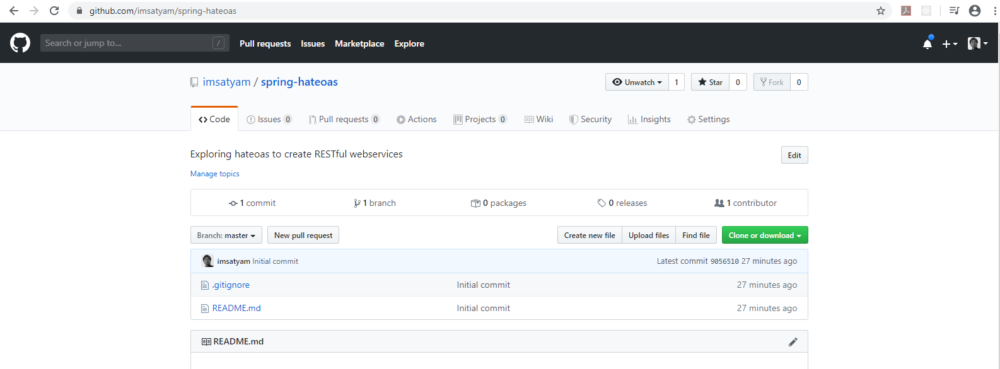

### HATEOAS - What?
- HATEOAS stands for the phrase **H**ypermedia **A**s **T**he **E**ngine **O**f **A**pplication **S**tate
- Ridiculous acronym. Isn't it?
- Wikipedia says - ```With HATEOAS, a client interacts with a network application whose application servers provide information dynamically through hypermedia. A REST client needs little to no prior knowledge about how to interact with an application or server beyond a generic understanding of hypermedia.```

### Understanding Hypermedia

The term **hypermedia** refers to any content that contains links to other forms of media such as images, movies, and text.

When we are navigating across a webpage, it displays all the relevant
details. Moreover webpage also offers a number of actions that can be taken by the user on the displayed data.

Let us take a look at the github repository screenshot below:


In addition to the repository details, we have actions like:
- Clicking on buttons (Clone or Download)
- Clicking on tabs (Pull Requests)

Can these links be dynamic to reduce coupling between the web client and the backend REST API?

### An typical REST Service

- REST API to get list of all the students i.e. `GET v1/students` returns following response:
```json
[
    {
        "id": 1,
        "name": "Student_1"
    },
    {
        "id": 2,
        "name": "Student_2"
    },
    {
        "id": 3,
        "name": "Student_3"
    }
]
```

- REST API to get student with given id i.e. `GET v1/students/1` returns following response:
```json
{
    "id": 1,
    "name": "Student_1"
}
```

- Typically when we make a request, we only get the data and not any actions around it.
- This works as long as the client knows how to form the url to get the data of a student.
- What if we want to avoid it?

### HATEOAS driven REST API
REST architectural style allows us to use hypermedia links in the response contents so that the client can dynamically navigate to the appropriate resource by traversing the hypermedia links.

Here our `GET v1/students` api returns following response:
```json
[
    {
        "id": 1,
        "name": "Student_1",
        "links": [
            {
                "href": "v1/students/1"
            }
        ]   
    },
    {
        "id": 2,
        "name": "Student_2",
       "links": [
           {
               "href": "v1/students/2"
           }
       ]   
    },
    {
        "id": 3,
        "name": "Student_3",
       "links": [
           {
               "href": "v1/students/3"
           }
       ]   
    }
]
```
This allows clients to rely on the links present in the response itself, instead of
having own logic to assume/create the url for action of getting details of one student.

### HATEOAS representations
- [RFC 5988 - Web Linking](https://tools.ietf.org/html/rfc5988)
- [Hypermedia Application Language](https://en.wikipedia.org/wiki/Hypertext_Application_Language)
   - The two associated MIME types are
        - media type: `application/hal+xml`
        - media type: `application/hal+json`
   - Each link in HAL may contain the following properties: 
     - **Target URI**: It indicates the target resource URI. This is represented by the `href` attribute.
     - **Link relation**: The link relation type describes how the current context is related to the target resource. This is represented by the `rel` attribute.
     - **Type**: This indicates the expected resource media type. This is represented by the `type` attribute.

### Spring-HATEOAS
Spring HATEOAS provides some APIs to ease creating REST representations that follow the HATEOAS principle when working with Spring and especially Spring MVC. The core problem it tries to address is link creation and representation assembly.

**Features**
- Model classes for link, resource representation models
- Link builder API to create links pointing to Spring MVC controller methods
- Support for hypermedia formats like HAL

**Spring Boot Config**

Spring Boot will do the following:
- Configure HAL support
- Register support for entity links
- Wire up message converter support.

### PoC
- Intent of this PoC is to explore working of HATEOAS.
- A simple service is created using HATEOAS principles.
- Service provides endpoints to list students, courses and courses which a student has enrolled with.

### Service Endpoints and Response
###### List all the students
`GET http://localhost:8080/students`
```json
{
    "_embedded": {
        "studentList": [
            {
                "id": 1,
                "firstName": "John",
                "lastName": "Smith",
                "_links": {
                    "self": {
                        "href": "http://localhost:8080/students/1"
                    },
                    "enrollments": {
                        "href": "http://localhost:8080/students/1/enrollments"
                    }
                }
            },
            {
                "id": 2,
                "firstName": "Jane",
                "lastName": "Smith",
                "_links": {
                    "self": {
                        "href": "http://localhost:8080/students/2"
                    },
                    "enrollments": {
                        "href": "http://localhost:8080/students/2/enrollments"
                    }
                }
            },
            {
                "id": 3,
                "firstName": "John",
                "lastName": "Doe",
                "_links": {
                    "self": {
                        "href": "http://localhost:8080/students/3"
                    },
                    "enrollments": {
                        "href": "http://localhost:8080/students/3/enrollments"
                    }
                }
            }
        ]
    },
    "_links": {
        "self": {
            "href": "http://localhost:8080/students"
        }
    }
}
```
###### List all the courses
`GET http://localhost:8080/courses`
```json
{
    "_embedded": {
        "courseList": [
            {
                "id": 1,
                "name": "HATEOAS - An introduction",
                "_links": {
                    "self": {
                        "href": "http://localhost:8080/courses/1"
                    }
                }
            },
            {
                "id": 2,
                "name": "HATEOAS with Spring",
                "_links": {
                    "self": {
                        "href": "http://localhost:8080/courses/2"
                    }
                }
            },
            {
                "id": 3,
                "name": "Understanding Hypermedia",
                "_links": {
                    "self": {
                        "href": "http://localhost:8080/courses/3"
                    }
                }
            }
        ]
    },
    "_links": {
        "self": {
            "href": "http://localhost:8080/courses"
        }
    }
}
```

###### Get enrollment details of a student
`GET http://localhost:8080/students/1/enrollments`
```json
{
    "_embedded": {
        "courseList": [
            {
                "id": 1,
                "name": "HATEOAS - An introduction",
                "_links": {
                    "self": {
                        "href": "http://localhost:8080/courses/1"
                    },
                    "courses": {
                        "href": "http://localhost:8080/courses"
                    }
                }
            },
            {
                "id": 2,
                "name": "HATEOAS with Spring",
                "_links": {
                    "self": {
                        "href": "http://localhost:8080/courses/2"
                    },
                    "courses": {
                        "href": "http://localhost:8080/courses"
                    }
                }
            },
            {
                "id": 3,
                "name": "Understanding Hypermedia",
                "_links": {
                    "self": {
                        "href": "http://localhost:8080/courses/3"
                    },
                    "courses": {
                        "href": "http://localhost:8080/courses"
                    }
                }
            }
        ]
    },
    "_links": {
        "self": {
            "href": "http://localhost:8080/students/1/enrollments"
        }
    }
}
```

### Running the application
1. Please ensure that you have Java and Maven installed on the machine.
2. Checkout the the code and navigate to the root directory of the project.
3. Run command `mvn spring-boot: run`


### Resources

**Books**
- [Spring Rest](https://www.oreilly.com/library/view/spring-rest/9781484208236/)
- [Rest in Practice: Hypermedia and Systems Architecture](https://www.amazon.com/REST-Practice-Hypermedia-Systems-Architecture/dp/0596805829)

**Useful Articles**

- [Rest API Tutorial](https://restfulapi.net/hateoas/)
- [Spring HATEOAS](https://spring.io/projects/spring-hateoas)
- [What is HATEOAS](https://www.springboottutorial.com/rest-api-what-is-hateoas)
- [DZone - What is HATEOAS](https://dzone.com/articles/rest-api-what-is-hateoas)
- [Hypermedia driven Rest API](https://geeknarrator.com/2018/05/24/hypermedia-driven-rest-apis-hateoas/)
- [HATEOAS - Wikipedia](https://en.wikipedia.org/wiki/HATEOAS)

**Videos**

- [How to get along with HATEOAS without letting the bad guys steal your lunch?](https://www.youtube.com/watch?v=IL2PlsbvUDs)
- [Spring HATEOAS - Hypermedia APIs with Spring](https://www.youtube.com/watch?v=o4cc6KzNrpI)
- [Rest Web Services 08 - HATEOAS](https://www.youtube.com/watch?v=NK3HNEwDXUk)

**Code Samples**
- [Spring-hateoas examples](https://github.com/spring-projects/spring-hateoas-examples)
